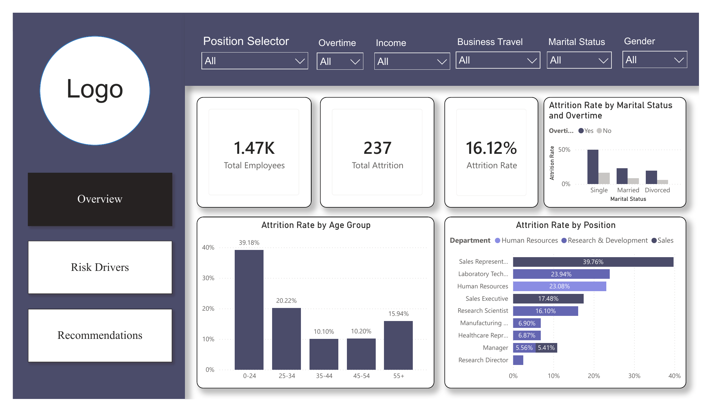
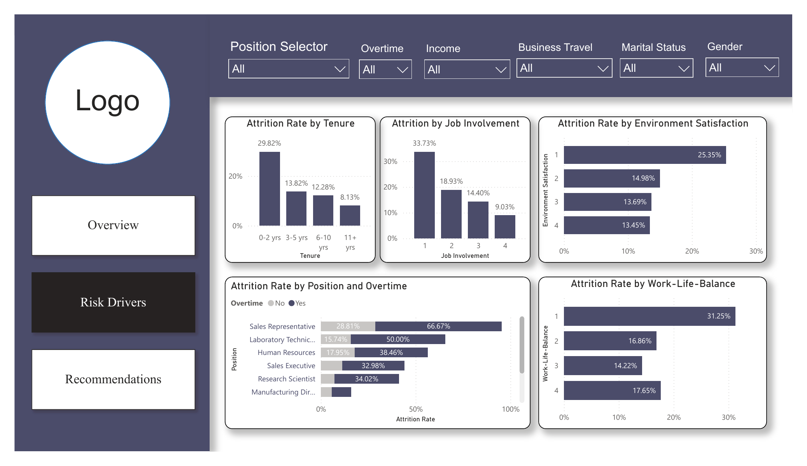
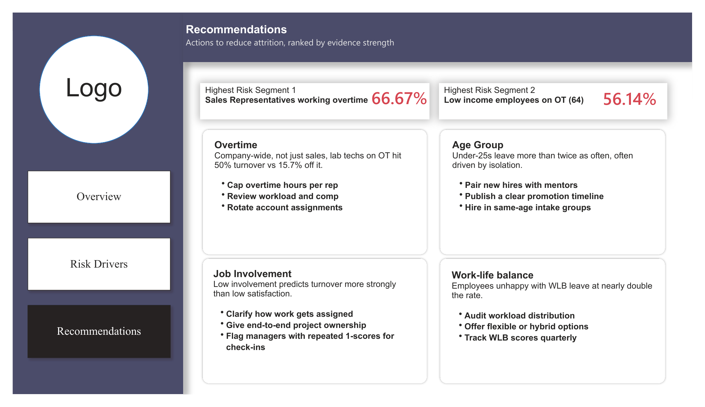

# HR Attrition Analysis & Power BI Dashboard

End-to-end HR attrition case study: SQL data modeling, Python-based employee segmentation, and an interactive Power BI dashboard that identifies the strongest drivers of attrition and translates them into ranked, actionable recommendations.



## Business Problem

The organization has a **16.12% attrition rate** (237 of 1,470 employees). This project investigates *who* is leaving and *why*, then ranks interventions by strength of evidence rather than presenting attrition drivers as a flat list.

## Key Findings

| Driver | Insight |
|---|---|
| Overtime | Employees working overtime attrite at ~3x the rate of those who don't (highest: Sales Reps on OT at 66.67%) |
| Age | Under-25s leave more than twice as often as older cohorts (39.18% vs. 10-20% for other groups) |
| Job Involvement | Low job involvement predicts turnover more strongly than low job satisfaction |
| Work-Life Balance | Employees reporting poor WLB leave at nearly double the rate of those reporting good WLB |
| Tenure | Attrition is heavily front-loaded: 29.82% in the first 0-2 years, dropping to 8.13% at 11+ years |

Full breakdown and ranked recommendations are on the **Recommendations** page of the dashboard.

## Repository Structure

```
├── README.md
├── dashboard/
│   ├── HR_Attrition_Dashboard.pbix      # Power BI source file
│   └── HR_Attrition_Dashboard.pdf       # Exported/published report
├── data/
│   └── HR_Attrition_Case_Study.xlsx     # Source employee dataset
├── sql/
│   └── attrition_analysis.sql           # Attrition by department & job role
├── python/
│   ├── classification.py                # Experience-level segmentation
│   └── requirements.txt
├── docs/
│   └── HR_Attrition_Presentation.pptx   # Stakeholder-facing summary deck
└── screenshots/
    ├── 01_overview.png
    ├── 02_risk_drivers.png
    └── 03_recommendations.png
```

## Dashboard Preview

**Overview** — headline KPIs and attrition by age group / position


**Risk Drivers** — attrition cut by tenure, job involvement, environment satisfaction, work-life balance, and overtime


**Recommendations** — highest-risk segments and actions ranked by evidence strength


## Tools & Techniques

- **Power BI** — data modeling (star schema: Fact_Attrition + Dim_Department, Dim_JobRole), DAX measures, interactive slicers, multi-page report
- **SQL** — aggregation joins across fact/dimension tables to surface attrition by department and job role
- **Python (pandas)** — employee experience-level segmentation (Junior/Mid/Senior) via list comprehension, with a vectorized `pd.cut()` alternative for scale

## How to Run

**SQL**
Run `sql/attrition_analysis.sql` against a database with `Fact_Attrition`, `Dim_Department`, and `Dim_JobRole` tables loaded from `data/HR_Attrition_Case_Study.xlsx`.

**Python**
```bash
cd python
pip install -r requirements.txt
python classification.py
```

**Power BI**
Open `dashboard/HR_Attrition_Dashboard.pbix` in Power BI Desktop. If you don't have Power BI installed, view `dashboard/HR_Attrition_Dashboard.pdf` or the screenshots above.